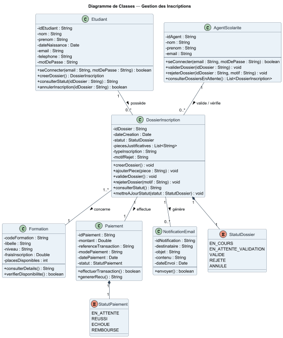
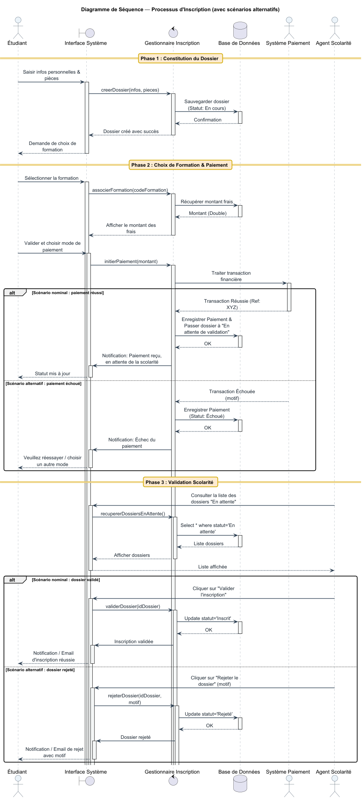

# TD01_UML - Système de Gestion des Inscriptions

Projet de modélisation UML réalisé dans le cadre du TD de Génie Logiciel (Master 1 GL — UASZ).
Il couvre la modélisation complète d'un **système de gestion des inscriptions universitaires** : cas d'utilisation, diagramme de classes, diagramme de séquence, description textuelle, user stories et implémentation Java des classes du domaine.

## 👥 Équipe (Groupe 1)

| Membre |
|---|
| Medoune Massaly |  
| Abdoul Aziz Sy |
| Halimatou Balde |  
| Mariama Kesso Dia |


## 📁 Structure du projet

```
TD01_UML/
├── Diagrammes/                      # Exports images des diagrammes UML
│   ├── cas d'utilisation.png
│   ├── classe.png
│   └── sequence.png
│
├── Documents/                       # Livrables documentaires
│   ├── Groupe_1_description_textuelle_user_story.docx
│   └── Liste_des_acteurs.docx
│
├── src/main/java/
│   ├── code.puml/                   # Sources PlantUML des diagrammes
│   │   ├── classe.puml
│   │   ├── sequence.puml
│   │   └── useCase.puml
│   │
│   └── (package du modèle)          # Classes Java du domaine
│       ├── AgentScolarite.java
│       ├── DossierInscription.java
│       ├── Etudiant.java
│       ├── Formation.java
│       ├── NotificationEmail.java
│       ├── Paiement.java
│       ├── StatutDossier.java       # (enum)
│       └── StatutPaiement.java      # (enum)
│
├── .gitignore
├── pom.xml                          # Configuration Maven du projet
└── README.md
```

---

## 🧩 1. Diagramme de Cas d'Utilisation

Acteurs : **Étudiant**, **Agent de Scolarité**, **Système de Paiement** (acteur secondaire).
Tous les cas principaux incluent (`<<include>>`) le cas **Authentification**.


## 🧩 2. Diagramme de Classes

Classes du domaine : `Etudiant`, `AgentScolarite`, `DossierInscription`, `Formation`, `Paiement`, `NotificationEmail`, avec les énumérations `StatutDossier` et `StatutPaiement`.



## 🧩 3. Diagramme de Séquence

Processus d'inscription en 3 phases (constitution du dossier → choix de formation & paiement → validation scolarité), avec scénarios alternatifs (paiement échoué, dossier rejeté).



---

## 📝 4. Description Textuelle des Cas d'Utilisation

Résumé structuré (détail complet dans `Documents/Groupe_1_description_textuelle_user_story.docx`) :

| Cas d'utilisation | Acteur(s) | Précondition | Scénario nominal | Scénario alternatif | Postcondition |
|---|---|---|---|---|---|
| **CU0 — Authentification** | Étudiant / Agent | Compte existant | Saisie identifiants → accès à l'espace | Identifiants incorrects → message d'erreur | Utilisateur connecté |
| **CU1 — Créer un dossier** | Étudiant | Authentifié | Saisie infos + pièces → dossier créé (statut "En cours") | Champs invalides/pièces manquantes → erreur affichée | Dossier créé |
| **CU2 — Choisir une formation** | Étudiant | Dossier créé | Sélection formation → frais affichés | Formation indisponible → liste alternative proposée | Formation associée au dossier |
| **CU3 — Payer les frais** | Étudiant, Système de Paiement | Formation choisie | Paiement via système externe → statut "En attente de validation" | Paiement échoué → notification d'échec, possibilité de réessayer | Paiement enregistré |
| **CU4 — Consulter son statut** | Étudiant | Authentifié | Consultation du statut du dossier en temps réel | Dossier introuvable → message d'erreur | Statut affiché |
| **CU5 — Valider l'inscription** | Agent de Scolarité | Dossier payé, en attente | Vérification → validation → statut "Validé" | Dossier incomplet/invalide → rejet avec motif → statut "Rejeté" | Inscription validée ou rejetée + notification email (extension possible) |

## 📋 5. User Stories (Backlog Produit)

Format : *En tant que [rôle], je veux [action], afin de [bénéfice]*.
Détail complet et critères d'acceptation dans `Documents/Groupe_1_description_textuelle_user_story.docx` — prêt à l'import Jira/Trello.

### Epic 1 — Authentification
| ID | User Story | Priorité |
|---|---|---|
| US-01 | En tant qu'étudiant, je veux m'authentifier, afin d'accéder à mon espace personnel | Haute |
| US-02 | En tant qu'agent de scolarité, je veux m'authentifier avec un rôle distinct, afin d'accéder aux fonctions de validation | Haute |

### Epic 2 — Constitution du Dossier
| ID | User Story | Priorité |
|---|---|---|
| US-03 | En tant qu'étudiant, je veux créer un dossier d'inscription, afin de démarrer ma démarche | Haute |
| US-04 | En tant qu'étudiant, je veux joindre mes pièces justificatives, afin de compléter mon dossier | Haute |

### Epic 3 — Formation & Paiement
| ID | User Story | Priorité |
|---|---|---|
| US-05 | En tant qu'étudiant, je veux choisir une formation, afin de connaître le montant des frais | Haute |
| US-06 | En tant qu'étudiant, je veux payer mes frais via le système de paiement, afin de valider ma demande | Haute |
| US-07 *(alt.)* | En tant qu'étudiant, je veux être informé en cas d'échec de paiement, afin de pouvoir réessayer | Moyenne |

### Epic 4 — Validation du Dossier (Agent de Scolarité)
| ID | User Story | Priorité |
|---|---|---|
| US-08 | En tant qu'agent, je veux consulter les dossiers "en attente", afin de traiter les inscriptions | Haute |
| US-09 | En tant qu'agent, je veux valider un dossier, afin de confirmer l'inscription de l'étudiant | Haute |
| US-10 *(alt.)* | En tant qu'agent, je veux rejeter un dossier avec un motif, afin d'informer l'étudiant | Moyenne |

### Epic 5 — Suivi & Notifications
| ID | User Story | Priorité |
|---|---|---|
| US-11 | En tant qu'étudiant, je veux consulter le statut de mon dossier, afin de suivre l'avancement | Moyenne |
| US-12 *(extension)* | En tant qu'étudiant, je veux recevoir par email la décision de l'agent, afin d'être informé sans me reconnecter | Basse |

---

## 🛠️ Technologies utilisées

- **Java** — implémentation du modèle du domaine
- **Maven** (`pom.xml`) — gestion du projet
- **PlantUML** — sources des diagrammes UML (`.puml`)
- **Git / GitHub** — gestion de versions et collaboration

## 👀 Visualiser / modifier les diagrammes

Les sources éditables sont dans `src/main/java/code.puml/`. Pour modifier un diagramme :
1. Copier le contenu du fichier `.puml` correspondant
2. Coller sur [PlantUML Online Server](https://www.plantuml.com/plantuml/uml/) ou [PlantText](https://www.planttext.com)
3. Régénérer l'image et remplacer le `.png` dans `Diagrammes/`

## 🚀 Lancer le projet

```bash
git clone https://github.com/MmeDaff/TD01_UML.git
cd TD01_UML
mvn clean install
```

## 🤝 Contribuer (workflow de l'équipe)

1. Cloner le dépôt : `git clone https://github.com/MmeDaff/TD01_UML.git`
2. Créer une branche pour votre tâche : `git checkout -b nom-de-la-branche`
3. Committer vos changements : `git commit -m "Description claire du changement"`
4. Pousser la branche : `git push origin nom-de-la-branche`
5. Ouvrir une Pull Request vers `main` pour relecture par l'équipe avant fusion

## 📄 Licence

Projet académique — usage pédagogique (Master 1 Génie Logiciel, UASZ).
